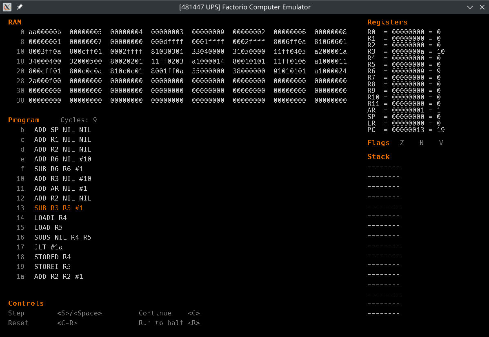

# FC-Tools
Tools for compiling and running programs for my custom computer architectures.

# Features
This project will slowly be developed and made feature complete.
Currently there exists:
- Horizon
    - [x] Parsing/compiling to internal/binary representation
    - [x] Compiling to blueprint string
    - [x] Executing compiled programs
- Graphical emulator
    - [x] Graphical program to run programs interactively
    - [x] Step by step debugging
    - [x] Inspect register and RAM state

# Building
Dependencies:
- SDL2
- SDL2_ttf

Then run `make help` for a list of make targets. `make` will compile the program without optimizations
and with debug symbols, while `make release` won't.

# Execution
## Compilation
To compile a Horizon program use `fcc`:
```shell
$ ./fcc -h
```

## Emulation
To run a Horizon program use `fcemu`:
```shell
$ ./fcemu -h
```
The input file can be a plaintext program, in which case it will be compiled with `fcc`, or a compiled
binary file created with `fcc` beforehand.

Running the program launches the visual runner:


# Blueprint strings
The blueprints for the actual computers can be found in the `bp` directory.

For the blueprints of Overture, an 8-bit architecture inspired by the one featured in the game Turing Complete,
or Everest, the precursor to Horizon, refer to
[factorio-computing](https://github.com/giodueck/factorio-computing).
